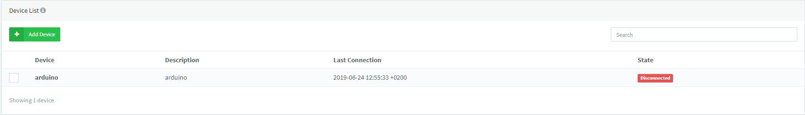
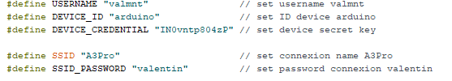

# Documentation technique du projet Plante Connectée

## Matériels requis
* Arduino Uno Wifi Rev 2
* DHT11 (capteur Humidité de l'air et de temprature)
* APDS 9301 (capteur d'humidité du sol)
* SEN019 (capteur de luminosité)

## Pré-requis

* Disposer d'un compte Thinger.io utilisable
* D'une connexion internet
* Plugin de l'IDE web d'arduino

## Configuration

###*Creer un device dans votre panneau de configuration Thinger.io*

[Thinger](https://console.thinger.io/#/login)

### *Champs à remplir avec vos informations*

* Username -> Thinger.io
* Device ID -> nom de l'appareil
* Device_credential -> Token thinger.io
* SSID / SSID_PASSWORD -> information relative de la connexion

##  Guide d'utilisation de l'application

* Executer le fichier python_interfaces.py
* Se connecter avec ses identifiants Thinger.io
* Sélectionner l'appareil que vous souhaitez utiliser
* Selectionner la plante que vous désirez
* Selectionner une des propositions suggérées

### Fonctionnalité des propositions :

#### Les besoins

Permet de voir les conditions idéales relatives à chaques plantes

#### Les informations

Permet de voir en direct les informations que les capteurs envoyent et les comparent aux conditions idéales

#### Biographie

Donne des indications / renseignements sur la plante (géoalisation, nom complet...)

